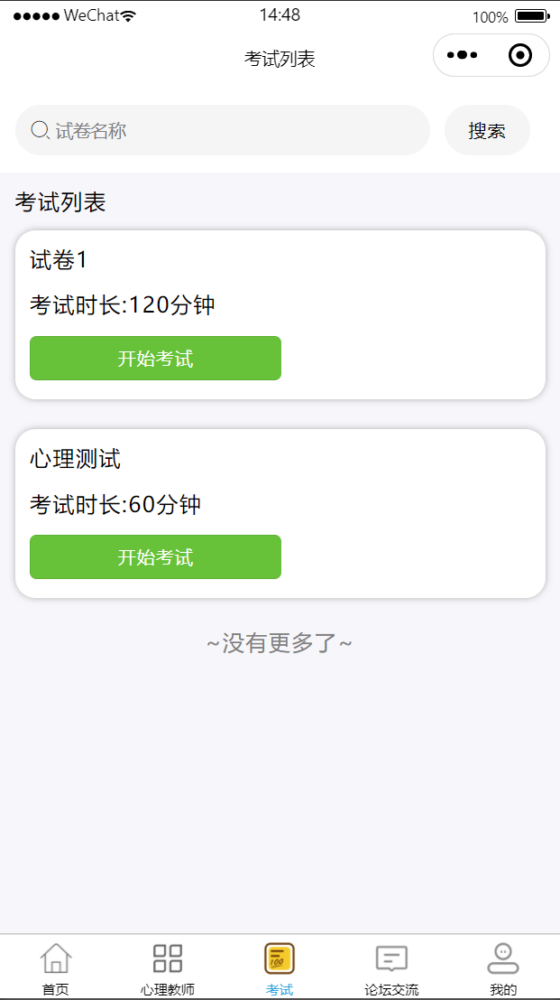

# mpweixinA095
mpweixinA095心理疏导防控微信小程序（Vue3+原生）
 
## 源码问题查看主页咨询

### 一、关键词
心理关怀微信小程序，心理疏导微信小程序，个人心理疏导微信小程序

### 二、作品包含
源码+数据库+全套环境和工具资源+本地部署教程

### 三、项目技术
前端技术： Html、Css、Js、Vue3.0、Element-ui
后端技术：Java、SpringBoot2.0、MyBatis

### 四、运行环境（以下版本亲测，其他版本兼容性请自行测试）
开发工具：IDEA/eclipse  + VSCODE + 微信开发者工具 

数据库：MySQL5.7（最低要5.7版本）

数据库管理工具：Navicat10以上版本

环境配置软件： JDK1.8 + Maven3.6.3

前端Nodejs：16

浏览器：谷歌浏览器

### 五、项目介绍
项目编号：mpweixinA095

心理疏导防控微信小程序可便捷为用户提供心理测评、情绪疏导、危机干预指导、心理健康知识科普等服务，助力用户及时调节心理状态、防控心理问题。
在线交流管理：支持师生在线留言交流，可查看、回复、删除留言。
论坛管理：可对论坛相关内容进行管理操作。
轮播图管理：用于管理首页轮播展示的图片等内容。
用户管理：对使用系统的用户账号等信息进行管理。
心理知识管理：可新增、修改、删除心理知识相关内容，方便用户学习心理知识。
心理教师管理：能新增、修改、删除心理教师信息，还可进行教师预约及查看咨询信息。
考试管理：提供试卷列表、考试记录、心理测试、试题管理等功能，支持心理测试和试卷考试的相关操作。
个人中心（我的）：可进行密码修改、在线交流、查看发布与收藏内容、管理心理教师以及查看考试记录等操作。

### 六、运行截图

